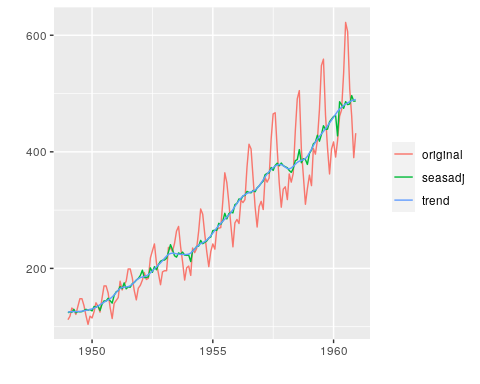
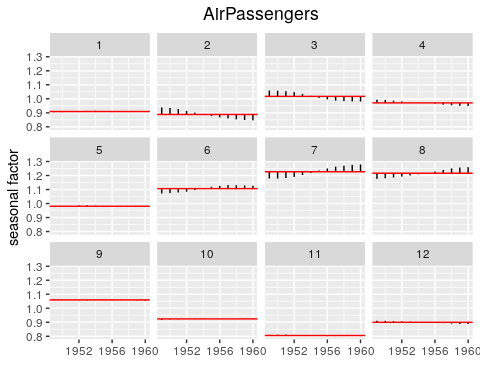

# `sadj`

Conduct seasonal adjustment using X13-ARIMA-SEATS from R. Almost all
X13-ARIMA-SEATS functionality is supported, including the use of
composite adjustments.

# Installation

If you have a public SSH key set up correctly with
[GitLab](https://gitlabstats-prd):

``` r
library(git2r)
library(devtools)

install_git(
  "git@gitlabstats-prd:cxhansen/sadj.git",
  credentials = cred_ssh_key(),
  build_vignettes = TRUE
)
```

Using HTTPS:

``` r
library(git2r)
library(devtools)

ssl_cert_locations(filename = "/etc/ssl/certs/ca-certificates.crt")
install_git("https://gitlabstats-prd/cxhansen/sadj.git", build_vignettes = TRUE)
```

# Basic Usage

The `sadj` package allows for relatively flexible use of the underlying
`X13-ARIMA-SEATS` program. But results can be produced quickly and
easily by accepting default parameters. Consider the following:

``` r
ap <- X13Series(AirPassengers)
```

This produces an object, `ap`, of class `X13Series`. This object is
initialised with the built-in `AirPassengers` object–a time series
holding the classic Box and Jenkins airline passengers data. Once
imported, the data is coerced into a `data.frame` which looks as
follows:

``` r
head(ap, 10)
```

| year | period | value |
| ---: | -----: | ----: |
| 1949 |      1 |   112 |
| 1949 |      2 |   118 |
| 1949 |      3 |   132 |
| 1949 |      4 |   129 |
| 1949 |      5 |   121 |
| 1949 |      6 |   135 |
| 1949 |      7 |   148 |
| 1949 |      8 |   148 |
| 1949 |      9 |   136 |
| 1949 |     10 |   119 |

In fact, while we provide the ability to create an `X13Series` object
directly from a `ts` object because it is a commonly used type in R, we
can also create one from a `data.frame` like the one displayed above.

An `X13Series` object has a number of attributes stored interally, such
as the adjustment specifications required by the `X13-ARIMA-SEATS`
program. For example, the specifications are held in an attribute called
`SpecList`, and can be retrieved via `getSpecList(ap)`:

``` r
getSpecList(ap)
```

    series{
      save=(b1)
    }
    
    x11{
      mode=mult
      sigmalim=(1.8,2.8)
      save=(d8 d10 d11 d12 d13 c17)
    }

The specification is actually an R list, but it has a print method that
displays a familiar string representation. In this case, a default,
minimal specification was provided, but there are facilities for
providing different specifications when creating `X13Series` objects, or
modifying specifications for existing objects. The details of working
with specifications are outlined in a vignette,
`vignette("specifications", package = "sadj")`.

In this simple example, no adjustment specifications were explicitly
provided. In actual fact, though, a default specification was provided,
and the original call to `X13Series` could have been written in the
following equivalent way:

``` r
ap1 <- X13Series(AirPassengers, type = "x11")
```

If the SEATS adjustment method is preferred over X11, then a default
SEATS adjustment is also readily available:

``` r
ap2 <- X13Series(AirPassengers, type = "seats")
getSpecList(ap2)
```

    series{
      save=(b1)
    }
    
    transform{
      function=auto
    }
    
    automdl {}
    
    seats{
      save=(s10 s11 s12 s13 s14 s16 s18 cyc ltt)
    }

Seasonal adjustment is carried out by calling `adjust` on an adjustable
object:

``` r
ap.res <- adjust(ap)
```

The result in this case is of class `X13SeriesResult`. It is a data
frame containing the raw series and `X13-ARIMA-SEATS` output tables such
as `d10`, `d11`, and `d12` as
columns:

``` r
head(ap.res, 10)
```

| year | period | value |  b1 | c17 |       d10 |      d11 |      d12 |       d13 |        d8 |
| ---: | -----: | ----: | --: | --: | --------: | -------: | -------: | --------: | --------: |
| 1949 |      1 |   112 | 112 |   1 | 0.9032879 | 123.9915 | 125.1880 | 0.9904425 | 0.8958401 |
| 1949 |      2 |   118 | 118 |   1 | 0.9387842 | 125.6945 | 125.5189 | 1.0013992 | 0.9411153 |
| 1949 |      3 |   132 | 132 |   1 | 1.0588508 | 124.6635 | 125.7773 | 0.9911445 | 1.0499907 |
| 1949 |      4 |   129 | 129 |   1 | 0.9942750 | 129.7428 | 125.9183 | 1.0303728 | 1.0246508 |
| 1949 |      5 |   121 | 121 |   1 | 0.9767154 | 123.8846 | 125.9227 | 0.9838144 | 0.9610430 |
| 1949 |      6 |   135 | 135 |   1 | 1.0717429 | 125.9630 | 125.9575 | 1.0000438 | 1.0720059 |
| 1949 |      7 |   148 | 148 |   1 | 1.1789500 | 125.5354 | 126.2282 | 0.9945114 | 1.1724746 |
| 1949 |      8 |   148 | 148 |   1 | 1.1760639 | 125.8435 | 126.6648 | 0.9935162 | 1.1677522 |
| 1949 |      9 |   136 | 136 |   1 | 1.0638393 | 127.8389 | 127.2535 | 1.0045996 | 1.0672713 |
| 1949 |     10 |   119 | 119 |   1 | 0.9167217 | 129.8104 | 127.9213 | 1.0147676 | 0.9288268 |

In fact, any output produced by `X13-ARIMA-SEATS` that is a time series
is added as a column to the output data frame. The columns can vary
depending on the adjustement specification and, besides, are somewhat
esoteric. For this reason, helper functions exist for extracting the
more common components of an adjusted series in a more uniform way. For
example, the raw, seasonally adjusted and trend series can be accessed
by calling `actual`, `seasadj`, and `trend`, respectively.

``` r
head(trend(ap.res), 10)
```

| year | period |    trend |
| ---: | -----: | -------: |
| 1949 |      1 | 125.1880 |
| 1949 |      2 | 125.5189 |
| 1949 |      3 | 125.7773 |
| 1949 |      4 | 125.9183 |
| 1949 |      5 | 125.9227 |
| 1949 |      6 | 125.9575 |
| 1949 |      7 | 126.2282 |
| 1949 |      8 | 126.6648 |
| 1949 |      9 | 127.2535 |
| 1949 |     10 | 127.9213 |

Output that isn’t a times series is stored as an attribute. For example,
the ‘`UDG`’ file, if present, is a file containing a range of summary
statistics and the like, and is read in as a list and stored as an
attribute called `udg`. Many of these attributes aren’t directly useful,
and helper functions are instead provided which give the appropriate
access. For example, calling `summary` on an adjusted series will cause
the HTML version of the output to display, or else it will cause a
relatively pretty tabular version of the `udg` attribute to display:

``` r
summary(ap.res, html = TRUE)
```


or:

``` r
summary(ap.res)
```

| stat   | value      |
| :----- | :--------- |
| f2.mcd | 3          |
| f2.ic  | 1.34       |
| f2.is  | 3.10       |
| f2.msf | 2.705 0.38 |
| f3.m01 | 0.106      |
| f3.m02 | 0.104      |
| f3.m03 | 0.169      |
| f3.m04 | 0.643      |
| f3.m05 | 0.315      |
| f3.m06 | 0.362      |
| f3.m07 | 0.202      |
| f3.m08 | 0.354      |
| f3.m09 | 0.309      |
| f3.m10 | 0.379      |
| f3.m11 | 0.346      |
| f3.q   | 0.27       |
| f3.qm2 | 0.29       |

There are a range of built-in plotting functions provided to visualise
the
results:

``` r
plot(ap.res)
```



``` r
plot(ap.res, type = "seasonal")
```



A simple result viewer is also provided as a Shiny app. For example, to
view the `ap.res` object above, simply run:

``` r
view(ap.res)
```

(Note the lower case ‘v’.) This will yield:

\[img/viewer01.png\]

It will also work with grouped adjustments, for example:

\[img/viewer02.png\]

Again, these are very simple interfaces, but they serve as a reasonable
proof of concept which could easily be extended.
