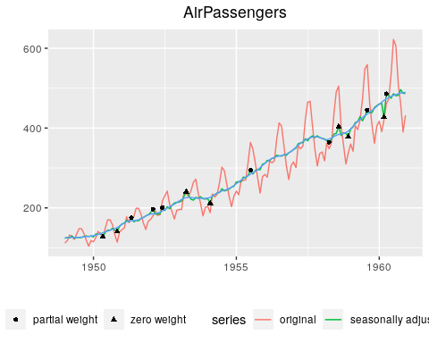

# sadj

The `sadj` package allows for relatively flexible use of the underlying
`X13-ARIMA-SEATS` program.

-----

**Copyright and Licensing**

The package is Crown copyright (c) 2021, Statistics New Zealand on
behalf of the New Zealand Government, and is licensed under the MIT
License (see LICENSE
file).

<br /><a rel="license" href="http://creativecommons.org/licenses/by/4.0/"></a><br />This
document is Crown copyright (c) 2021, Statistics New Zealand on behalf
of the New Zealand Government, and is licensed under the Creative
Commons Attribution 4.0 International License. To view a copy of this
license, visit <http://creativecommons.org/licenses/by/4.0/> or send a
letter to Creative Commons, PO Box 1866, Mountain View, CA 94042, USA.

\[\[*TOC*\]\]

## Single Series

Results can be produced quickly and easily by accepting default
parameters. Consider the following:

``` r
ap <- X13Series(AirPassengers)
```

This produces an object, `ap`, of class `X13Series`. This object is
initialised with the built-in `AirPassengers` object–a time series
holding the classic Box and Jenkins airline passengers data. Once
imported, the data is coerced into a `data.frame` which looks as
follows:

``` r
head(ap, 10)
```

| date       | year | period | value |
| :--------- | ---: | -----: | ----: |
| 1949-01-01 | 1949 |      1 |   112 |
| 1949-02-01 | 1949 |      2 |   118 |
| 1949-03-01 | 1949 |      3 |   132 |
| 1949-04-01 | 1949 |      4 |   129 |
| 1949-05-01 | 1949 |      5 |   121 |
| 1949-06-01 | 1949 |      6 |   135 |
| 1949-07-01 | 1949 |      7 |   148 |
| 1949-08-01 | 1949 |      8 |   148 |
| 1949-09-01 | 1949 |      9 |   136 |
| 1949-10-01 | 1949 |     10 |   119 |

In fact, while we provide the ability to create an `X13Series` object
directly from a `ts` object because it is a commonly used type in R, we
can also create one from a `data.frame` like the one displayed above.

An `X13Series` object has a number of attributes stored interally, such
as the adjustment specifications required by the `X13-ARIMA-SEATS`
program. For example, the specifications are held in an attribute called
`SpecList`, and can be retrieved via `getSpecList(ap)`:

``` r
getSpecList(ap)
```

    series{
      save=(b1)
    }
    
    x11{
      mode=mult
      sigmalim=(1.8,2.8)
      save=(d8 d10 d11 d12 d13 c17)
    }

The specification is actually an R list, but it has a print method that
displays a familiar string representation. In this case, a default,
minimal specification was provided, but there are facilities for
providing different specifications when creating `X13Series` objects, or
modifying specifications for existing objects. The details of working
with specifications are outlined in a vignette,
`vignette("specifications", package = "sadj")`.

In this simple example, no adjustment specifications were explicitly
provided. In actual fact, though, a default specification was provided,
and the original call to `X13Series` could have been written in the
following equivalent way:

``` r
ap1 <- X13Series(AirPassengers, type = "x11")
```

If the SEATS adjustment method is preferred over X11, then a default
SEATS adjustment is also readily available:

``` r
ap2 <- X13Series(AirPassengers, type = "seats")
getSpecList(ap2)
```

    series{
      save=(b1)
    }
    
    transform{
      function=auto
    }
    
    automdl {}
    
    seats{
      save=(s10 s11 s12 s13 s14 s16 s18 cyc ltt)
    }

Seasonal adjustment is carried out by calling `adjust` on an adjustable
object:

``` r
ap.res <- adjust(ap)
```

The result in this case is of class `X13SeriesResult`. It is a data
frame containing the raw series and `X13-ARIMA-SEATS` output tables such
as `d10`, `d11`, and `d12` as
columns:

``` r
head(ap.res, 10)
```

| date       | year | period | value |  b1 | c17 |       d10 |      d11 |      d12 |       d13 |        d8 |
| :--------- | ---: | -----: | ----: | --: | --: | --------: | -------: | -------: | --------: | --------: |
| 1949-01-01 | 1949 |      1 |   112 | 112 |   1 | 0.9032879 | 123.9915 | 125.1880 | 0.9904425 | 0.8958401 |
| 1949-02-01 | 1949 |      2 |   118 | 118 |   1 | 0.9387842 | 125.6945 | 125.5189 | 1.0013992 | 0.9411153 |
| 1949-03-01 | 1949 |      3 |   132 | 132 |   1 | 1.0588508 | 124.6635 | 125.7773 | 0.9911445 | 1.0499907 |
| 1949-04-01 | 1949 |      4 |   129 | 129 |   1 | 0.9942750 | 129.7428 | 125.9183 | 1.0303728 | 1.0246508 |
| 1949-05-01 | 1949 |      5 |   121 | 121 |   1 | 0.9767154 | 123.8846 | 125.9227 | 0.9838144 | 0.9610430 |
| 1949-06-01 | 1949 |      6 |   135 | 135 |   1 | 1.0717429 | 125.9630 | 125.9575 | 1.0000438 | 1.0720059 |
| 1949-07-01 | 1949 |      7 |   148 | 148 |   1 | 1.1789500 | 125.5354 | 126.2282 | 0.9945114 | 1.1724746 |
| 1949-08-01 | 1949 |      8 |   148 | 148 |   1 | 1.1760639 | 125.8435 | 126.6648 | 0.9935162 | 1.1677522 |
| 1949-09-01 | 1949 |      9 |   136 | 136 |   1 | 1.0638393 | 127.8389 | 127.2535 | 1.0045996 | 1.0672713 |
| 1949-10-01 | 1949 |     10 |   119 | 119 |   1 | 0.9167217 | 129.8104 | 127.9213 | 1.0147676 | 0.9288268 |

In fact, any output produced by `X13-ARIMA-SEATS` that is a time series
is added as a column to the output data frame. The columns can vary
depending on the adjustement specification and, besides, are somewhat
esoteric. For this reason, helper functions exist for extracting the
more common components of an adjusted series in a more uniform way. For
example, the raw, seasonally adjusted and trend series can be accessed
by calling `actual`, `seasadj`, and `trend`, respectively.

``` r
head(trend(ap.res), 10)
```

| year | period |    trend |
| ---: | -----: | -------: |
| 1949 |      1 | 125.1880 |
| 1949 |      2 | 125.5189 |
| 1949 |      3 | 125.7773 |
| 1949 |      4 | 125.9183 |
| 1949 |      5 | 125.9227 |
| 1949 |      6 | 125.9575 |
| 1949 |      7 | 126.2282 |
| 1949 |      8 | 126.6648 |
| 1949 |      9 | 127.2535 |
| 1949 |     10 | 127.9213 |

Output that isn’t a times series is stored as an attribute. For example,
the ‘`UDG`’ file, if present, is a file containing a range of summary
statistics and the like, and is read in as a list and stored as an
attribute called `udg`. Many of these attributes aren’t directly useful,
and helper functions are instead provided which give the appropriate
access. For example, calling `summary` on an adjusted series will cause
the HTML version of the output to display, or else it will cause a
relatively pretty tabular version of the `udg` attribute to display:

``` r
summary(ap.res, html = TRUE)
```


or:

``` r
summary(ap.res)
```

| stat    | value        |
| :------ | :----------- |
| f2.mcd  | 3            |
| f2.ic   | 1.34         |
| f2.is   | 3.10         |
| f2.fsd8 | 186.047 0.00 |
| f2.msf  | 2.705 0.38   |
| f3.m01  | 0.106        |
| f3.m02  | 0.104        |
| f3.m03  | 0.169        |
| f3.m04  | 0.643        |
| f3.m05  | 0.315        |
| f3.m06  | 0.362        |
| f3.m07  | 0.202        |
| f3.m08  | 0.354        |
| f3.m09  | 0.309        |
| f3.m10  | 0.379        |
| f3.m11  | 0.346        |
| f3.q    | 0.27         |
| f3.qm2  | 0.29         |

There are a range of built-in plotting functions provided to visualise
the
results:

``` r
plot(ap.res)
```



``` r
plot(ap.res, type = "d10")
```


## Batch Series

The first thing you might want to do is run seasonal adjustment on your
existing `X13-ARIMA-SEATS` file setup and evaluate the results. You
might do something like the following:

1.) Read the series batch in from an `.mta` file:

``` r
mta_path <- "~/Network-Shares/corp-nas/seasadj/hlfs/hlfs.mta"
hlfs <- X13BatchFromMTA(mta_path)
```

2.) Seasonally adjust the series batch:

``` r
hlfs_res <- adjust(hlfs)
```

3.) View summary information of the result:

``` r
print(hlfs_res)
summary(hlfs_res)

# Print T-vals of regressors
tvals(hlfs_res)
```

### Interrogate

4.) Interrogate specific series from the batch

``` r
library(magrittr) # for pipes

# Use the snames from print/summary of the batch result to plug into `selectSeries`:
munemp_res <- hlfs_res %>% selectSeries("munemp")

# Spin up a Shiny to view plots and diagnostics
munemp_res %>% view()

# View summary diagnostic information
munemp_res %>% summary()

# View full html diagnostic report
munemp_res %>% summary(html=TRUE)

# What plots are there?
?sadj:::plot.X13SeriesResult

# Try a plot
munemp_res %>% plot(type="D10D8")

# How about an interactive plot?
munemp_res %>% plot(type="D10D8", interactive = TRUE)

```

5.) Interrogate an entire batch

``` r
# Query Specs

# getParamVals.X13Batch
res <- getParamVals(hlfs,"series","span") %>% map( ~.x[[1]])

# getSpecParameter.X13Batch
# Same as getParamVals but it doesn't try to parse individual values
# Example of querying documenation
?sadj:::getSpecParameter.X13Batch 
```

### Update/Modify

6.) Update/Modify an entire batch

``` r
# Modify Specs

# Add/remove outliers
# Add a Level shift to all series in a batch
# (Try querying to verify this)
addOutliers(hlfs) <- "LS2020.2"

# Remove the level shift
removeOutliers(hlfs) <- "LS2020.2"
# By default, removeOutliers does not clear out the save argument
# That is something to be fixed, but for now:
setSpecParameter(hlfs, "regression", "save") <- NULL

# Add outliers to a subset of series:
setSpecParameter(hlfs
                 , snames = c("munemp", "funemp")
                 ,"regression", "variables") <- c("LS1980.3")
```

## Sadj objects Summary

### Input Objects

| Object         | Structure                        | Comments                                                                                                                                                                                                          |
| :------------- | :------------------------------- | :---------------------------------------------------------------------------------------------------------------------------------------------------------------------------------------------------------------- |
| X13Batch       | A list of X13SeriesGroup objects | A batch of X13Series objects as specified by an MTA file.                                                                                                                                                         |
| X13SeriesGroup | A list of X13Series objects      | X13Series object groupings which are delineated by empty spaces inside an MTA file (see note). Either 0 or 1 composites are allowed at the end of a group and nowhere else.                                       |
| X13Series      | A dataframe of time series data  | Can have several attributes to represent the following X13 files that can be associated with a single series: spc, fac, regression. Read the X13Series section to learn how to access and modify these attributes |

### Output Objects

| Object               | Structure                                           | Comments                                                                                                                                                                          |
| :------------------- | :-------------------------------------------------- | :-------------------------------------------------------------------------------------------------------------------------------------------------------------------------------- |
| X13SeriesResult      | A dataframe of seasonally adjusted time series data | Has attributes that represent quality diagnostics and calculated modelling parameters                                                                                             |
| X13SeriesGroupResult | A list of X13SeriesResult objects                   | X13SeriesResult object groupings which are delineated by empty spaces inside an MTA file (see note). Either 0 or 1 composites are allowed at the end of a group and nowhere else. |
| X13BatchResult       | A list of X13SeriesGroupResult objects              | A batch of X13SeriesResult objects as specified by an MTA file.                                                                                                                   |

**Note: Empty lines in an MTA file do not mean anything to the X13
program. They are a Statistics NZ convention and they do mean something
to the sadj package - The groupings are submitted to X13 as their own
batches.**

## Interacting with Objects

### Modifying Seasonal Adjustment Congfigurations (SPC files)

`X13Series` is a dataframe with time series input data. It has
attributes that are accessible/mutable with the following
functions:

| get              | set              | comments                                                                                    |
| :--------------- | :--------------- | :------------------------------------------------------------------------------------------ |
| getSpecList      | setSpecList      | Method gets passed to the X13SpecList object which is attached to X13Series as an attribute |
| getSpec          | setSpec          | Same as comment above                                                                       |
| getSpecParameter | setSpecParameter | Same as comment above                                                                       |
| getFacFile       | setFacFile       | get/set the factor file dataframe attached to the the X13Series                             |
| getRegFile       | setRegFile       | get/set the regression file dataframe attached to the the X13Series                         |

## X13Batch Objects

## Vignettes
